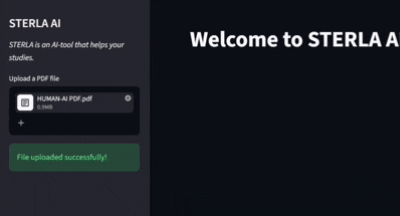

🤖 STERLA AI — PDF RAG Chatbot

📌 Overview

STERLA AI is an AI-powered document assistant that allows users to upload PDF files and ask questions about their content.

It uses Retrieval-Augmented Generation (RAG) to retrieve relevant information from documents and generate accurate, context-aware responses using Large Language Models (LLMs).

---

✨ Features

- 📄 Upload PDF documents
- 💬 Ask questions in natural language
- 🔍 Intelligent document retrieval using vector search
- 🧠 Context-aware AI responses using RAG
- ⚡ Interactive and user-friendly Streamlit interface
- 🔐 Secure API key handling using environment variables

---

🛠️ Tech Stack

- Python
- Streamlit
- LangChain
- Google Gemini
- ChromaDB
- PyPDF
- Python Dotenv
- Git & GitHub

---

⚙️ RAG Workflow
'''text
PDF Upload
     ↓
Document Loading
     ↓
Text Splitting
     ↓
Embedding Generation
     ↓
ChromaDB Vector Store
     ↓
Retriever
     ↓
Gemini LLM
     ↓
AI Response
'''
---

📂 Project Structure
'''text
STERLA AI/
│
├── app.py              # Streamlit user interface
├── rag.py              # RAG pipeline implementation
├── requirements.txt    # Required Python packages
├── .gitignore          # Ignored files and folders
└── README.md           # Project documentation
'''
---

🚀 Installation & Setup

1. Clone the repository

git clone https://github.com/MOHANRAJ-crtl/sterla-ai-rag-chatbot.git

2. Navigate to the project folder

cd sterla-ai-rag-chatbot

3. Install dependencies

pip install -r requirements.txt

4. Create a ".env" file

GOOGLE_API_KEY=your_api_key_here

5. Run the application

streamlit run app.py

---

📸 ##DEMO
     

---

📚 Learning Outcome

Through this project, I gained practical experience in building a complete RAG pipeline, including document processing, text chunking, embeddings, vector databases, retrieval, and LLM integration.

---

⭐ Acknowledgement

This project was built as part of my journey to explore AI, Large Language Models, and Retrieval-Augmented Generation.
